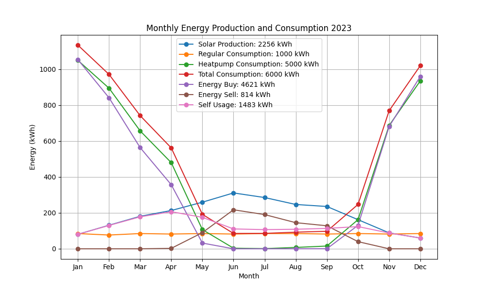

# Home Energy Flow


This repository allows to simulate the electric energy flow in a building
with a PV system, a battery and a certain electric consumption profile including
temperature-dependent heating by a heatpump.

The simulation is based on the hourly meteorological data for a specific location.
This includes the solar radiation for the PV system and the outside temperature for the
heatpump.

## Example Usage

See also the `example.py` file.
```python
year = 2023

# Define the PV system as 4 bifacial modules with 500 Wp each.
# They are bifacial and thus equivalent to 8 monofacial modules.
# They are vertically mounted (slope=90) and oriented to the east and west.
# For legyl reasons, the maximum power is limited to 0.8 kW.
pv_system_balkonkraftwerk = PVSystem(
    modules=[
        Modules(slope=Slope(value=90), azimuth=Azimuth.EAST(), kWP=0.5, n=4),
        Modules(slope=Slope(value=90), azimuth=Azimuth.WEST(), kWP=0.5, n=4),
    ],
    maximum_power_kW=0.8,
)
# The storage capacity of the battery is 2 kWh.
storage_kWh = 2.0

# The household has a regular consumption of 1000 kWh per year.
# Additionally, the heat pump consumes 5000 kWh per year, but only between 8:00 and
# 18:00 and proportional to the temperature difference between inside and outside.
regular_consumption_kWh = 1000.0
heatpump_system = HeatPumpSystem(
    yearly_electricity_consumption_kWh=5000.0,
    inside_temp=15.0,
    heating_times=[(8, 18)],
)

# Run the simulation and visualize the results
main(
    year=year,
    pv_system=pv_system_balkonkraftwerk,
    storage_kWh=storage_kWh,
    regular_consumption_kWh=regular_consumption_kWh,
    heatpump_system=heatpump_system,
)
```
## Example Output




## Next steps

There are many next steps to improve this project:


### Development workflow

To improve the development workflow, the following steps should be taken:
- Add unittests
- Add end-to-end tests
- Add CI for ensuring that the formatting and typechecking is always correct
- Add CI for the unittests and end-to-end tests
- Publish the package on PyPi

### Missing Features

New features that could be added are:
- Cost calculations, not only with fixed-price electricity, but also with dynamic prices.
- Dynamic consumers, e.g. electric cars that can be charged or discharged.
- More detailed heat pump model, e.g. with a COP that depends on the outside temperature.
- More detailed PV model, e.g. with a temperature-dependent efficiency.
- More detailed regular consumption model, e.g. vary it between weekdays and weekends.
- Optimization options, recommending the best battery size, PV size, etc.

## Installation

Create a vitual environment then install the package in the pypackage.toml

We recommend using [uv](https://github.com/astral-sh/uv) as virtual environment,
project and package manager.

```bash
curl -LsSf https://astral.sh/uv/install.sh | sh
uv venv .venv
source .venv/bin/activate
make install-dev
```


## Development

The code is formatted using `ruff` and typechecked using `mypy`.
To use them, call `make format && make static-checks`.


